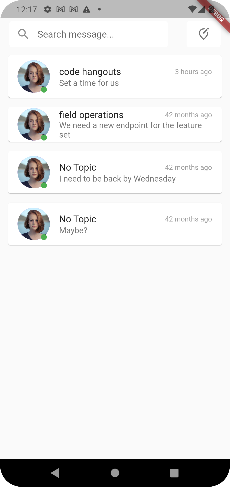
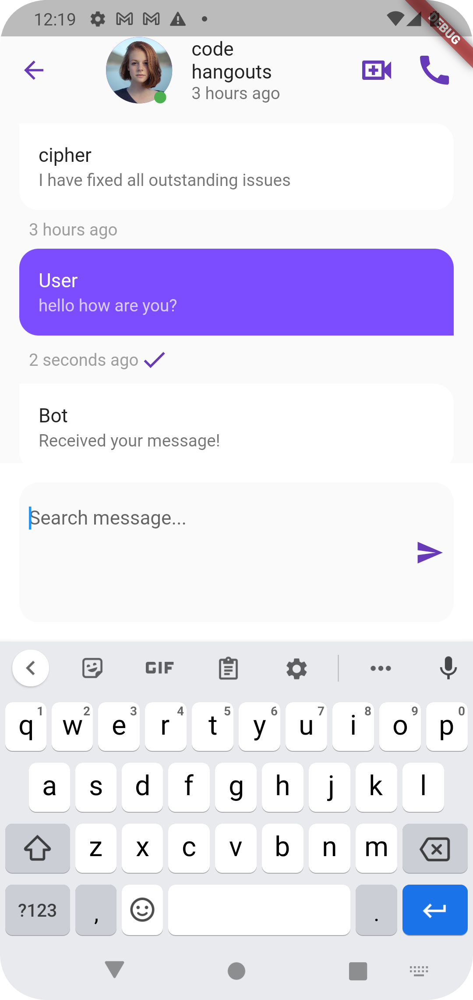

# Chat App

## Description

The Chat App is a mobile application built with Flutter that allows users to engage in real-time conversations. Users can create chat rooms, send messages, and view the conversation history. It provides a seamless and intuitive interface for communication.

## Features

- Create chat rooms
- Send and receive messages in real-time
- View conversation history
- User authentication and authorization
- User-friendly interface

## Screenshots
### Home page

### chat page

## Technologies Used

- Flutter
- Dart
- HTTP package for API communication
- Bloc pattern for state management

## Getting Started

### Prerequisites

- Flutter SDK (version 3.0.1)
- Dart SDK (version 2.0.1)
- Android Studio or Visual Studio Code

### Installation

1. Clone the repository:
   git clone https://github.com/tekporlipos/chat-app.git

    Navigate to the project directory:

cd chat-app

Install the dependencies:

flutter pub get

Run the application:

    flutter run

Usage

    Launch the Chat App on your mobile device or emulator.
    Sign up or log in to create an account.
    Create a new chat room or join an existing one.
    Start sending and receiving messages in real-time.

API Documentation

The Chat App utilizes a custom API for fetching conversations and messages. For API documentation, please refer to the API Documentation.
Configuration

The Chat App requires the following configuration:

    Firebase project setup with authentication enabled.
    API endpoint configuration in the ApiService class.

Testing

To run the tests for the Chat App, use the following command:

flutter test

Contributing

Contributions to the Chat App are welcome!

 If you find any issues or want to contribute enhancements, feel free to submit a pull request. Please follow the contribution guidelines specified in the CONTRIBUTING.md file.
License

This project is licensed under the MIT License. See the LICENSE file for more details.
Acknowledgements

    OpenAI for providing the ChatGPT model used for generating responses.
    Flutter community for their amazing support and resources.

Contact

For any questions or inquiries, please contact John Doe.
Additional Information

For additional information and resources, refer to the Wiki page of this project.

Please note that this is just a template, and you should customize it based on the specifics of your project.
